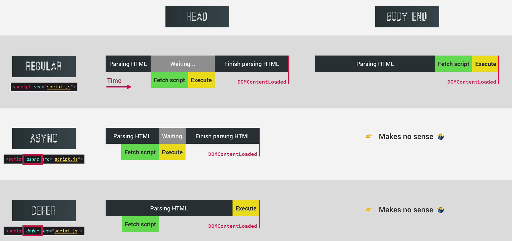

# JS Notes

### Javascript Overview :

- High Level [Developer need not to manage resources, everything happens automatically]
- Garbage Collected [automatic garbage collection]
- Interpreted or JIT compiled [Entire code is converted into machine code at once, then executed immediately]
- Multi paradigm [it allows all the available paradigms i.e. oop, procedural, functional]
- Prototype-based object-oriented
- First Class Functions [functions treated as variables]
- Dynamically typed [no data type definitions, types become known at runtime]
- Single Threaded
- Non blocking event loop

---

### Javascript Engine :

- Parsing [code is parsed into AST - Abstract Syntax Tree]
- Compilation [takes parsed code (AST) and compiles it to Machine Code]
- Execution [execution happens in call stack]
- Optimization [never ending process loop. takes current unoptimized code and returns optimized code to compiler]

---

### Javascript Runtime :

- Runtime in the browser has :

  - Engine [Heap, Call Stack]
  - WEB APIs [DOM, Timers, Fetch API, . . . ]
  - Callback Queue [onclick, timer, . . . ]

---

### Execution Context :

- Environment in which a piece of JS is executed. Stores all the necessary information for some code to be executed.

  - Global Execution context (i.e. top level) is created for code that is not inside any function.
  - One execution context is created for each function call.
  - Execution of functions (which are called) and waiting for callbacks (events)

- Inside Execution Context :

  - Variable Environment [let, const and var declaration, Functions, arguments object]
  - <a href="./03Intermediate/05scopeChain.js"> Scope Chain </a> <br/>
  - <a href="./03Intermediate/06thisKeyword.js"> This Keyword </a><br/>

---

### Hoisting :

- Makes some variables accessible/usable in the code even before they actually declared.

  - Function declaration : Yes [value -> actual function]
  - var variables : Yes [value -> undefined]
  - let and const variables : No [technically, yes. But the value is <uninitialized> as they are placed in Temporal Dead Zone]
  - function expressions and arrow functions : [depends if they uses var or let/const]

- Temporal Dead Zone :
  All the let/const variable get their own TDZ until the line where it is defined. The variable is only safe to use after TDZ.
  TDZ makes it easier to avoid and catch errors.

More on <a href="./03Intermediate/04hoisting.js"> Hoisting </a><br/>

---

### This Keyword :

- Special variable that is created for every execution context (every function). Takes the value of (points to) the "owner" of the function in which the "this" keyword is used.

  - Method : this = Object that is calling the method
  - Simple fn call : this = undefined
  - Arrow fn : this = this of surrounding function (lexical this)
  - EventListener : this = DOM element that the handler is attached to

- More details :

  - <a href="./03Intermediate/06thisKeyword.js">This keyword basics </a>
  - <a href="./03Intermediate/15thisAgain.js">This keyword example</a>

- Regular Function vs Arrow Function :
  - Regular fn has its own this keyword whereas arrow function inherits this keyword from parent scope.

---

### Primitives vs Objects (Reference)

- Primitives :

  - Number
  - String
  - Boolean
  - Undefined
  - Null
  - Symbol
  - Bigint

- Reference Types :

  - Object literal
  - Arrays
  - Functions
    .. etc

- Primitive type stored in call stack(EC) and reference type are stored in heap.

  ```
  let lastName = 'Williams'
  let oldLastName = lastName
  lastName = 'Davis'
  console.log(lastName, oldLastName) // Davis Williams

  const jessica = {
      firstName : 'Jessica',
      lastName : 'Williams',
      age : 27
  }

  // Problem
  const marriedJessica = jessica
  marriedJessica.lastName = 'Davis'

  console.log("before marriage", jessica); // Jessica Devis
  console.log("after marriage", marriedJessica); // Jessica Devis

  // Shallow Copy [this will fail if object has array and we're updating the array]
  const marriedJessicaCopy = Object.assign({}, jessica)
  marriedJessicaCopy.lastName = 'Davis'

  console.log("before marriage", jessica); // Jessica Williams
  console.log("after marriage", marriedJessica); // Jessica Devis
  ```

---

### Modern Operators

- Destructuring :
  way of extracting multiple values from data stored in (possibly nested) objects and Arrays.
  More on <a href="https://github.com/SumitJadiya/JSTube/blob/master/09DSUsingJS/script.js#L42">Destructuring</a>

- Spread :
  when we have (...) operator in right side of = sign
  More on <a href="./06LittleAdvanced/05spread.js">SPREAD Operator</a>

- Rest :
  when we have (...) operator in left side of = sign
  More on <a href="https://github.com/SumitJadiya/JSFromZeroToInfinity/blob/master/06LittleAdvanced/05spread.js#L44">REST Operator</a>

- Short Circuiting :
  && and || operator are known as short circuiting

- Coercion (truthy and falsy values) : <br/>
  Falsy Values : 0, undefined, NAN, null, '' <br/>
  other values are known as truthy values(returns true if placed inside if block).

- Nullish Coalescing Operator (??) :
  Works with the idea of nullish values instead of falsy values. Nullish values are null and undefined.

  ```
  let a;
  const result = a ?? 10; // a is nullish value
  console.log(result) // 10 (returns first not null value)
  ```

- Loops :

  - <a href="./03Intermediate/12loops.js"> For/while/do while </a> <br/>
  - <a href="./03Intermediate/13loopsPartTwo.js"> ForEach (not exactly loop but method for array) </a> <br/>
  - <a href="./03Intermediate/14loopsPartThree.js"> For of / in </a> <br/>

- Option Chaining (?.) :
  Instead of checking for null values explicitly, we can use option chaining to check the value and returns undefined immediately.

  ```
    console.log(a?.name)
    // returns undefined as a is not defined. Without "?.", JS will throw "Uncaught TypeError: Cannot read property 'name' of undefined"
  ```

- Sets :
  doesn't maintain order, doesn't allow duplicates

  ```
  const staff = ['Waiter', 'Chef', 'Waiter', 'Manager', 'Chef', 'Waiter'];
  const staffUnique = [...new Set(staff)];
  console.log(staffUnique); // returns unique items
  ```

- Maps :
  Read more on <a href="06LittleAdvanced/03maps.js">map</a>

- Strings :
  Read more on <a href="https://developer.mozilla.org/en-US/docs/Web/JavaScript/Reference/Global_Objects/String" target="_blank">Strings</a>

---

### functions

- Default Parameters :

  ```
  const sum = (a,b=20,c=10) => {
    return a+b+c; // 60
  }
  sum (30, undefined) // either leave empty or set to undefined to use default parameter
  ```

- Passing by value and passing by reference :
  JS doesn't have pass by reference (exception - passing object as parameter)

- First Class Functions :

  - JS treats functions as first-class citizen
  - It treats functions as simple values
  - functions are just another type of object <br/>

    ```
    // Store functions in variable
    const add = (a,b) => a+b;

    // pass function as arguments to other function
    const greet = () => console.log("Hey!");
    btn.addEventListener('click', greet);
    ```

  First class function is a concept in JS.

- Higher order functions :
  A function that receives another function as arguement, that returns a new function, or both. This is only possible bcz of first-class functions.

  ```
  // function that receive another function
  const greet = () => console.log("Hey!");
  btn.addEventListener('click', greet); // addEventListener is a higher order function

  // function that return another function
  function count(){
    let counter = 0;
    return function() {
      counter++;
    }
  }
  ```

  Higher order functions can be implemented using callbacks.

- Function returning Functions :

  ```
  const greet = function(greeting) {
    return function(name) {
      console.log(`${greeting}${name}`)
    }
  }

  const greetfn = greet('hey') // it will contain the function returned by greet
  greetfn("Sumit")

  or
  greet('Hello')('Sumit') //  this is same as previous calling
  ```

- Function Borrowing (call / apply / bind) :

  - Call :
    The call method allows for a method that was defined for one object to be assigned and called on by another object. This allows for a method to get defined once and then get inherited by other objects without having to re-write it for other objects.
  - Apply :
    Apply serves the exact same purpose as call. The only difference between the two is that call expects all parameters to be passed individually, whereas apply expects the second argument to be an array of all the parameters.

    ```
    var animal = {
      animalInfo: function(sound,food) {
        return this.name + " is " + this.age + " years old" + " . He makes the sound "+ sound + " and eats " + food
      }
    }

    var cat = {
      name : "Tom",
      age : 5
    }

    console.log(animal.animalInfo.call(cat,"meow", "fish")) // call
    console.log(animal.animalInfo.apply(cat,["meow", "fish"])) // apply
    ```

  - Bind (for partial function) :
    The bind function creates a new function whose this value can be set to the value provided during the function call, enabling the calling of a function with a specified this value (the first parameter to bind function)

    ```
    Ex. 1 :

    var obj = {
      name:"Tom"
    };

    var info = function(a,b,c){
      return this.name + " likes to eat " + a + " " + b + " and " +c;
    };

    //creates a bound function that has same body and parameters
    var bound = info.bind(obj,"Pasta");

    //calling the bound function later
    console.log(bound("Donuts","Chips","Cake")); // Tom likes to eat Pasta Donuts and Chips
    ```

    ```
    Ex. 2 :

    //without bind (closures)
    const addTaxRate = rate => {
      return function (value) {
        return value + value * rate;
      }
    }

    const addVat = addTaxRate(0.23)
    console.log(addVat(40))

    // with bind
    const addTax = (rate, value) => value + value * rate;

    // fix tax rate
    const vatTax = addTax.bind(null, 0.23)
    console.log(vatTax(100))
    console.log(vatTax(40))
    ```

- IIFE : Pattern that is used to declare functions which are required for one time use only.

  ```
  // Self Executing Anonymous function --> IIFE
  (function sayHello() {
    const isPrivate = 23; // encapsulated data
    console.log("I will never run again")
  })()
  ```

- Closures :

  - when function returning another function, the holding function will hold its environment ( basically all the variable it needed)
  - variable environment attached to the function, exactly as it was at the time and place the function was created
  - closure gives a fn access to all the variables of its parent function, even after that parent fn has returned. The function keeps reference to its outer space, which preserves the scope chain throughout time.
  - closure makes sure that a function does not lose the connection to a variables that existed at the time of function's birth.

  Closures used in :

  - Module design pattern
  - Currying
  - Function like once
  - memoize
  - maintaining state in async world
  - setTimeouts
  - Iterators etc.

    ```
    function secureBooking() {
        var passengerCount = 0
        return function () {
            passengerCount++;
            console.log(passengerCount) // fetch the value from lexical scope
        }
    }

    const booker = secureBooking()
    booker() // 1
    booker() // 2
    booker() // 3
    ```

---

### Array

- Simple Array Methods :

  - <a href="03Intermediate/09filterArray.js"> Slice, Splice, Filter, Reverse, Concat, Join </a>

- Data Transformation with MAP, FILTER, REDUCE :

  - MAP :
    MAP returns a new array containing the results of applying an operation on all original array elements.

    ```
    let arr = [1,2,3,4]

    arr.map(val => val*2;) // returns a new array
    ```

    ForEach vs Map : map creates new array whereas foreach uses the same array.

  - FILTER :
    FILTER returns a new array containing the array elements that passed a specified test condition

    ```
    let arr = [1,2,3,4]

    arr.filter(num => num%2==0) // returns a new array
    ```

  - REDUCE :
    this reduces all elements down to one single value (eg. adding all values)

    ```
    Syntax :
    arr.reduce (function (accumulator, currentValue, index, array){}, startValue)
    ```

    ```
    let arr = [1,2,3,4]
    const sum = arr.reduce((total, curr) => total+curr , 0)

    ```

  - FIND :
    The find() method returns the value of the first element in the provided array that satisfies the provided testing function. If no values satisfy the testing function, undefined is returned.

    ```
    Syntax:
    find((element) => { ... } )
    ```

    If you need the index of the found element in the array, use findIndex()

  - Which Array method to use ?
    <table>
    <tr>
      <td>To Mutate Original Array</td>
      <td>
      Add to original : .push(end), .unshift(start) <br/>
      Remove from original : .pop(end), .shift(start), .splice(any)<br/>
      Others : .reverse, .sort, .fill
      </td>
    </tr>
    <tr>
      <td>To get a new Array</td>
      <td>
      Computed from original :
      .map(loop) <br/>
      Filtered using condition : .filter <br/>
      portion of original : .slice <br/>
      adding original to other : concat <br/>
      flattening of original : .flat, .flatMap
      </td>
    </tr>
    <tr>
      <td>To get an array index</td>
      <td>
      Based on value : .indexOf<br/>
      Based on test condition : .findIndex<br/>
      </td>
    </tr>
    <tr>
      <td>to get an array element</td>
      <td>based on test condition : .find</td>
    </tr>
    <tr>
      <td>to know if array includes a number</td>
      <td>
      based on value : .includes <br/>
      based on test condition : .some, .every
      </td>
    </tr>
    <tr>
      <td>to get a new String</td>
      <td>based on separator string : .join</td>
    </tr>
    <tr>
      <td>to transform value</td>
      <td>based on accumulator : .reduce</td>
    </tr>
    <tr>
      <td>to loop an array</td>
      <td>based on callback : .forEach</td>
    </tr>
    </table>

---

### Numbers, Timer

- Converting and Checking Numbers

  ```
  console.log(23 === 23.0); // true
  // Base 10 - 0 to 9. 1/10 = 0.1. 3/10 = 3.3333333
  // Binary base 2 - 0 1
  console.log(0.1 + 0.2); // 0.30000000000000004
  console.log(0.1 + 0.2 === 0.3); // false
  ```

  ```
  // Conversion
  console.log(Number('23')); // 23
  console.log(+'23'); // 23
  ```

  ```
  // Parsing
  console.log(Number.parseInt('30px', 10)); // 30
  console.log(Number.parseInt('e23', 10)); // NaN
  console.log(Number.parseInt(' 2.5rem ')); // 2
  console.log(Number.parseFloat(' 2.5rem ')); // 2.5
  ```

- Timer

  - SetTimeout : This runs a method after specific time interval.

    ```
    const ingredients = ['olives', 'spinach'];
    const pizzaTimer = setTimeout(
      (ing1, ing2) => console.log(`Here is your pizza with ${ing1} and ${ing2} 🍕`),
      3000,
      ...ingredients
    );

    console.log('Waiting...'); // this will run before setTimeout

    if (ingredients.includes('spinach')) clearTimeout(pizzaTimer); // to clear timeout
    ```

  - SetInterval : This runs any method forever repeatedly after some time interval.

    ```
    const timer = setInterval(function () {
      const now = new Date();
      console.log(now);
    }, 1000);

    clearInterval(timer)
    ```

---

### DOM

- Selecting, Creating, Deleting Element :

  - Selection : document.getElementsBy<XYZ>, document.querySelector()

    ```
    const allSections = document.querySelectorAll('.section')
    ```

  - Insertion : document.createElement()

    ```
    const message = document.createElement('div')
    message.classList.add('cookie-message');
    message.textContent = 'text' // simple text
    message.innerHTML = `html content <button class='btn'>here!</button>`
    header.append(message) // append the message at last
    ```

  - Deletion : remove(), removeChild()

    ```
    document
    .querySelector('.btn--close-cookie)
    .addEventListener('click', function() {
      message.remove() // recent addition to JS
      message.parentElement.removeChild(message) // similar to previous line
    })
    ```

- Events :

  - Bubbling :
    In event bubbling, the handler first executes on the event attached to the target element, then on all its ancestors. It starts from the bottom (deepest layer) and goes to the top.

    ```
    // HTML
    <html>
    <head>
    </head>
    <body>
      <h1> Event Bubbling Example</h1>
      <div id="Box">
        <button id="myButton">Click Me!</button>
      </div>
    </body>
    </html>

    // JS
    var parent = document.getElementById("Box");
    parent.addEventListener("click", function() {
      console.log("Box is clicked");
    });
    var child = document.getElementById("myButton");
    child.addEventListener("click", function() {
      console.log("Button is clicked");
    });

    // OUTPUT
    Button is clicked
    Box is clicked
    ```

  - Capturing :
    In event capturing, when you click the button, the event passes from the parent down to the event target, the button (assigned to child).

    ```
    // HTML
    <html>
    <head>
    </head>
    <body>
      <h1> Event Bubbling Example</h1>
      <div id="Box">
        <button id="myButton">Click Me!</button>
      </div>
    </body>
    </html>

    // JS
    var parent = document.getElementById("Box");
    parent.addEventListener(
      "click",
      function() {
        console.log("Box is clicked");
      },
      true
    );
    var child = document.getElementById("myButton");
    child.addEventListener("click", function() {
      console.log("Button is clicked");
    });

    // OUTPUT
    Box is clicked
    Button is clicked
    ```

  - <a href="./Bankist/script.js#L86">Event Delegation</a> :
    Event Delegation is basically a pattern to handle events efficiently. Instead of adding an event listener to each and every similar element, we can add an event listener to a parent element and call an event on a particular target using the . target property of the event object.

  - DOM Traversal :

    - Downwards : element.childNodes, element.children
    - Upwards : element.parentNode, element.parentElement
    - Sideways : element.previousSibling, element.nextSibling

  - <a href="./Bankist/script.js#L181">Observer API Pattern</a>

    ```
    const observerCallback = function (entries, observer) {
      entries.forEach(entry => {
        console.log(entry)
      })
    }

    const observerOptions = {
      root: null,
      threshold: [0, 1, 0.2]
    }

    const observer = new IntersectionObserver(observerCallback, observerOptions)
    observer.observe(section1)
    ```

  - show message to user before closing tab :

    ```
    window.addEventListener('beforeunload', function (e) {
      e.preventDefault()
      e.returnValue = "" // browser will throw popup for confirmation
    })
    ```

  - defer and async script loading :

    

    - For async, the script order not guaranteed to execute in order. For defer, the order is guaranteed.

  - Note :

    - e.currentTarget and this variable are same for normal methods but different for arrow fns

      ```
      const handleScrolling = (e) => {
        e.preventDefault();
        const id = e.currentTarget.getAttribute('href')
        // this won't work as this points to window object
        // const id = this.getAttribute('href')
        document.querySelector(id).scrollIntoView({ behavior: 'smooth' })
      }
      ```

---

### OOPs

- Fundamental Priciples :

  - Abstraction : Hide details that don't matter
  - Encapsulation : keeping properties and method private inside class so they are not accessible outside the class
  - Inheritance : Make all properties and method of certain class available to child class
  - Polymorphism : child class can overwrite a method it inherited from a parent class

- <a href='00OOPS/script.js'> Prototypal Inheritance </a>:

  - The prototype contains methods (behaviour) that are accessible to all the objects linked to that prototype.
  - Behaviour is delegated to the linked prototype object

- Ways to implement Prototypal Inheritance

  - Constructor Function

    - Technique to create objects from a function
    - This is built-in objects like Arrays, Maps or sets are actually implemented

      ```
      // constructor function
      function Person () {
        this.name = 'John',
        this.age = 23
      }

      // create an object
      const person = new Person();
      ```

  - ES6 classes

    - Modern alternative to constructor function syntax (behind the scene works exactly like constructor function)
    - ES6 classes do not behave like classes in "classical OOP"

      ```
      class Animal {

      constructor(name, fierce){
        this._name = name;
        this._fierce = fierce;
      }

      get name() {
        return this._name;
      }

      get fierce() {
        return ` This animal is ${ this._fierce ? 'fierce' : 'tame' }`;
      }

      toString() {
        return `This is a ${ this._fierce ? 'fierce' : 'tame' } ${this._name}`;
      }

      }
      ```

  - Object.create()

    - The easiest and most straightforward way of linking an object to prototype object

      ```
      const PersonProto = {
        calcAge: function () {
          return new Date().getFullYear() - this.birthYear;
        }
      }

      const steven = Object.create(PersonProto)
      ```

- Prototype Chain

  - Object remains at the top in the chain

- Encapsulation in JS :

  - public fields

  - public method

  - private fields : indicated with # in front of variable name

    ```
    class Counter {
      #count = 0

      click () {
        this.#count += 1;
      }
      getCount () {
        return this.#count.toLocaleString()
      }
    }
    const myCounter = new Counter();
    myCounter.click();
    console.log(myCounter.getCount());
    ```

  - private method

---

### Javascript projects

1.  Color Flipper <br/>
2.  Counter <br/>
3.  Review System <br />
4.  Navbar <br/>
5.  Sidebar <br/>
6.  Modal <br/>
7.  QnA section <br/>
8.  Menu Project <br/>
9.  Control Video <br/>
10. Scroll Project <br/>
11. Tabs <br/>
12. Countdown Timer <br/>
13. Lorem Ipsum Generator <br/>
14. Todo List <br/>
15. Slider <br/>
16. Slider-2 <br/>
17. Stripe submenus <br/>

---

### Guess Number Project

Random number generated by system, goal is to predict the number <br />

 
<br/>
<br/>

