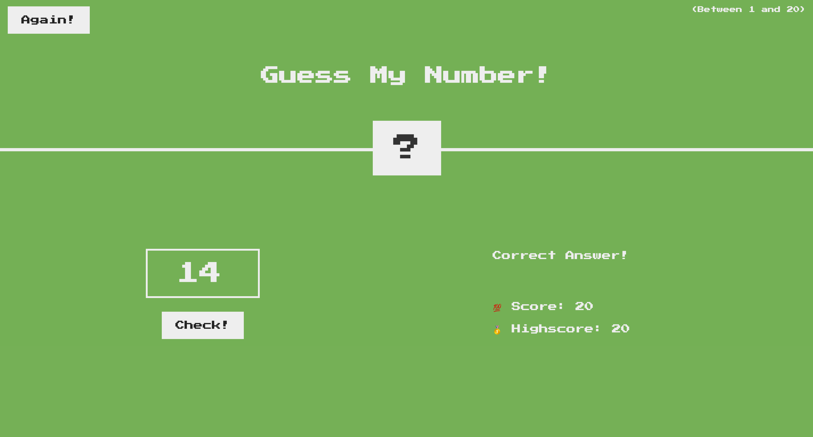

# JSTube

Javascript projects from basic to advanced on single repository.

1. Hello World

---

### Hello World

> We can run js code using two options :
>
> 1.  using index.html --> Link script file with HTML file and refresh the HTML file to run the javascript
> 2.  using node --> try node script.js [make sure nodejs is installed on the system]

### Variables

> 1.  var  
> 2.  let  
> 3.  const

### Internal Working of JavaScript

> <a href="https://github.com/SumitJadiya/JSTube/blob/master/03Intermediate/05scopeChain.js"> Scope Chain </a> 

### Conditional

> 1.  if else  
> 2.  && and || operator with if else 
> 3.  Ternary Operator 
> 4.  Coercion (truthy and falsy values) - Apart from undefined, NaN, null, 0, '' all are truthy value(returns true if placed inside if block).

### functions

> 1.  Calling and referencing 
> 2.  Functions in variable 
> 3.  Context 
> 4.  Hoisting 
> 5.  This Keyword

### Array

> 1.  Basics 
> 2.  Filter

### Object

> 1.  Basics 
> 2.  Function inside Object
> 3.  New Keyword

### Loops

> 1.  Basic for loop 
> 2.  while and do while 
> 3.  For Each loop (not exactly loop but method for array) 
> 4.  For of and For in

### DOM

> 1.  DOM Manipulation using getElement and querySelector 
> 2.  Counter App  
> 3.  Color code seletor App

### Intermediate Level

> 1.  Proto  
> 2.  Object Chain  
> 3.  Self Executing Anonymous function --> IIFE  
> 4.  Lexical Scoping  
> 5.  Closure  
> 6.  Curring [--> name()()()]  
> 7.  Binding (or bind)  
> 8.  Price Sorting Project  
> 9.  Scope  
> 10. Strings  
> 11. Maps  
> 12. Destructure  
> 13. Spread and REST  
> 14. Class and Objects 
> 15. Inheritance  
> 16. Event - Promise, Async, Await  
> 17. API Handling

### Projects

> 1.  Color Flipper  
> 2.  Counter  
> 3.  Review System  
> 4.  Navbar  
> 5.  Sidebar  
> 6.  Modal  
> 7.  QnA section  
> 8.  Menu Project  
> 9.  Control Video  
> 10. Scroll Project  
> 11. Tabs  
> 12. Countdown Timer  
> 13. Lorem Ipsum Generator  
> 14. Todo List  
> 15. Slider  
> 16. Slider-2  
> 17. Stripe submenus  
> 18. Hotel Reservation using react  

### Guess Number Project

Random number generated by system, goal is to predict the number  

>  
>  
>  
> 
