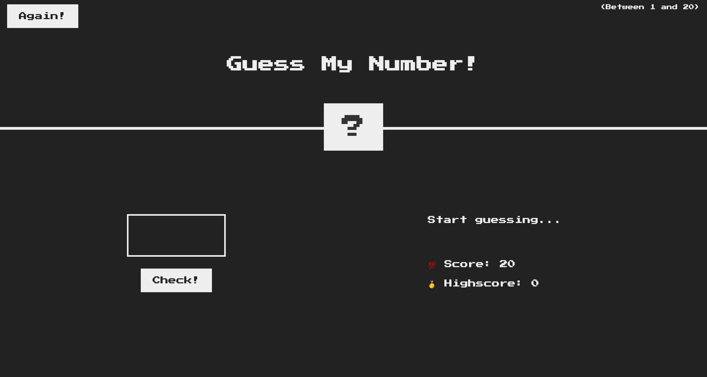

# JSTube

### Javascript Overview :

- High Level [Developer need not to manage resources, everything happens automatically]
- Garbage Collected [automatic garbage collection]
- Interpreted or JIT compiled [Entire code is converted into machine code at once, then executed immediately]
- Multi paradigm [it allows all the available paradigms i.e. oop, procedural, functional]
- Prototype-based object-oriented
- First Class Functions [functions treated as variables]
- Dynamically typed [no data type definitions, types become known at runtime]
- Single Threaded
- Non blocking event loop

---

### Javascript Engine :

- Parsing [code is parsed into AST - Abstract Syntax Tree]
- Compilation [takes parsed code (AST) and compiles it to Machine Code]
- Execution [execution happens in call stack]
- Optimization [never ending process loop. takes current unoptimized code and returns optimized code to compiler]

---

### Javascript Runtime :

Runtime in the browser has :

- Engine [Heap, Call Stack]
- WEB APIs [DOM, Timers, Fetch API, . . . ]
- Callback Queue [onclick, timer, . . . ]

---

### Execution Context :

Environment in which a piece of JS is executed. Stores all the necessary information for some code to be executed.

- Global Execution context (i.e. top level) is created for code that is not inside any function.
- One execution context is created for each function call.
- Execution of functions (which are called) and waiting for callbacks (events)

Inside Execution Context :

- Variable Environment [let, const and var declaration, Functions, arguments object]
- <a href="./03Intermediate/05scopeChain.js"> Scope Chain </a> <br/>
- <a href="./03Intermediate/06thisKeyword.js"> This Keyword </a><br/>

---

### Hoisting :

Makes some variables accessible/usable in the code even before they actually declared.

Function declaration : Yes [value -> actual function]
var variables : Yes [value -> undefined]
let and const variables : No [technically, yes. But the value is <uninitialized> as they are placed in Temporal Dead Zone]
function expressions and arrow functions : [depends if they uses var or let/const]

Temporal Dead Zone :
All the let/const variable get their own TDZ until the line where it is defined. The variable is only safe to use after TDZ.
TDZ makes it easier to avoid and catch errors.

More on <a href="./03Intermediate/04hoisting.js"> Hoisting </a><br/>

---

### This Keyword :

Special variable that is created for every execution context (every function). Takes the value of (points to) the "owner" of the function in which the "this" keyword is used.

Method : this = <Object that is calling the method>
Simple function call : this = undefined
Arrow function : this = <this of surrounding function (lexical this)>
Event Listener : this = <DOM element that the handler is attached to>

More details :
<a href="./03Intermediate/06thisKeyword.js">This keyword basics </a>
<a href="./03Intermediate/15thisAgain.js">This keyword example</a>

Regular Function vs Arrow Function :
Regular fn has its own this keyword whereas arrow function inherits this keyword from parent scope.

---

### Primitives vs Objects (Reference)

Primitives :

- Number
- String
- Boolean
- Undefined
- Null
- Symbol
- Bigint

Reference Types :

- Object literal
- Arrays
- Functions
  .. etc

Primitive type stored in call stack(EC) and reference type are stored in heap.

```
let lastName = 'Williams'
let oldLastName = lastName
lastName = 'Davis'
console.log(lastName, oldLastName) // Davis Williams

const jessica = {
    firstName : 'Jessica',
    lastName : 'Williams',
    age : 27
}

// Problem
const marriedJessica = jessica
marriedJessica.lastName = 'Davis'

console.log("before marriage", jessica); // Jessica Devis
console.log("after marriage", marriedJessica); // Jessica Devis

// Shallow Copy [this will fail if object has array and we're updating the array]
const marriedJessicaCopy = Object.assign({}, jessica)
marriedJessicaCopy.lastName = 'Davis'

console.log("before marriage", jessica); // Jessica Williams
console.log("after marriage", marriedJessica); // Jessica Devis
```

---

### Mordern Operators

- Destructuring :
  way of extracting multiple values from data stored in (possibly nested) objects and Arrays.
  More on <a href="https://github.com/SumitJadiya/JSTube/blob/master/09DSUsingJS/script.js#L42">Destructuring</a>

- Spread :

---

### Conditional

1.  if else <br/>
2.  && and || operator with if else<br/>
3.  Ternary Operator<br/>
4.  Coercion (truthy and falsy values) - Apart from undefined, NaN, null, 0, '' all are truthy value(returns true if placed inside if block).

### functions

1.  Calling and referencing<br/>
2.  Functions in variable<br/>
3.  Context<br/>

### Array

1.  Basics<br/>
2.  Filter

### Object

1.  Basics<br/>
2.  Function inside Object
3.  New Keyword

### Loops

1.  Basic for loop<br/>
2.  while and do while<br/>
3.  For Each loop (not exactly loop but method for array)<br/>
4.  For of and For in

### DOM

1.  DOM Manipulation using getElement and querySelector<br/>
2.  Counter App <br/>
3.  Color code seletor App

### Intermediate Level

1.  Proto <br/>
2.  Object Chain <br/>
3.  Self Executing Anonymous function --IIFE <br/>
4.  Lexical Scoping <br/>
5.  Closure <br/>
6.  Curring [name()()()] <br/>
7.  Binding (or bind) <br/>
8.  Price Sorting Project <br/>
9.  Scope <br/>
10. Strings <br/>
11. Maps <br/>
12. Destructure <br/>
13. Spread and REST <br/>
14. Class and Objects<br/>
15. Inheritance <br/>
16. Event - Promise, Async, Await <br/>
17. API Handling

### Javascript projects

1.  Color Flipper <br/>
2.  Counter <br/>
3.  Review System <br />
4.  Navbar <br/>
5.  Sidebar <br/>
6.  Modal <br/>
7.  QnA section <br/>
8.  Menu Project <br/>
9.  Control Video <br/>
10. Scroll Project <br/>
11. Tabs <br/>
12. Countdown Timer <br/>
13. Lorem Ipsum Generator <br/>
14. Todo List <br/>
15. Slider <br/>
16. Slider-2 <br/>
17. Stripe submenus <br/>

### Guess Number Project

Random number generated by system, goal is to predict the number <br />

 
<br/>
<br/>

